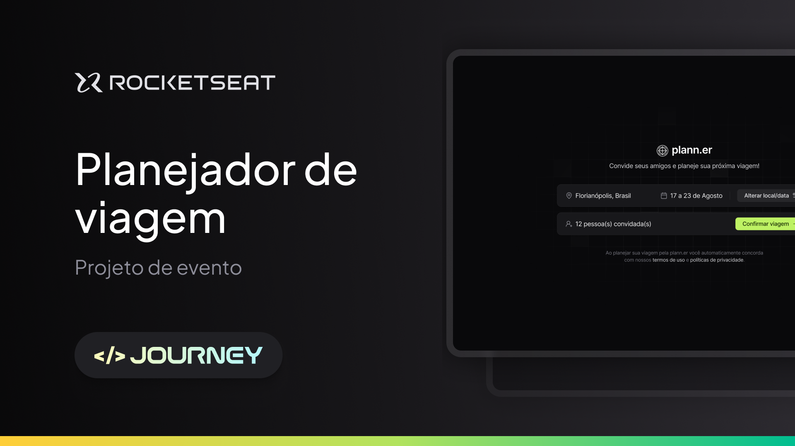

# plann.er - NLW Journey React



## Explicação sobre o projeto

Neste projeto foi criado um Website com React para criar uma viagem através do sistema planejador de viagem. Ele é responsável pela parte visual e por fazer requisições com o banco de dados através de uma API (Lado servidor).

O usuário agenda a viagem com data e local, podendo convidar outras pessoas, que precisam confirmar ou recusar presença até a data da viagem.
Outras ações poderão ser feitas também, como adicionar atividades relacionadas a viagem com horário em que serão feitas, adicionar links importantes, alterar
o local da viagem e/ou data e gerenciar os convidados.

## Funcionalidades

### Viagem

Esta funcionalide é a primeira disponível durante o acesso ao sistema, onde o usuário precisa escolher um local e a data da viagem, em seguida há uma etapa
para convidar pessoas e confirmar obrigatoriamente seus dados como nome e e-mail.
Após a criação da viagem, ele pode alterá-la, mudando tanto o local quanto a data.

### Participante

Esta ação é feita em primeiro momento durante a criação da viagem e é opcional. Depois pode ser gerenciado dentro da viagem, permitindo cancelar o
convite de um participante ou convidar um novo.

**Obs:** Um convidado pode recusar seu convite.

### Atividade

Aqui é um registro das atividades que serão realizadas durante a viagem, onde deve ser inserido uma breve descrição e a data com horário.

### Link

Nesta opção, é possível adicionar links relacionados a viagem. Por exemplo, o site do anúncio da hospedagem ou o site do restaurante que pretende almoçar.

## Tecnologias utilizadas

- **[React](https://react.dev/)**
- **[Typescript](https://www.typescriptlang.org/)**
- **[Tailwind](https://tailwindcss.com/)**
- **[React DayPicker](https://daypicker.dev/)**
- **[Lucide React](https://lucide.dev/)**
- **[Axios](https://axios-http.com/ptbr/)**
- **[date-fns](https://date-fns.org/)**
- **[Vite](https://vitejs.dev/)**

## Rotas

- [x] / (Página inicial)
- [x] /trips/{tripId} (Página da viagem)
- [x] /trips/{tripId}/confirm (Página de confirmação da viagem)
- [x] /participants/{participantId}/confirm (Página para o participante confirmar ou recusar sua participação na viagem)

## Instruções

Este projeto está pronto para rodar localmente em sua máquina e também para hospedar no [Vercel](https://vercel.com/).

Antes de rodar o servidor, é preciso realizar alguns passos importantes para que o projeto funcione da forma correta.

Crie um arquivo **.env** a partir do **.env.example** e faça as seguintes configurações:

```env
API_BASE_URL - URL da API
```

Em seguida, devemos instalar os pacotes essenciais.

### _Como efetuo a instalação dos pacotes?_

Execute o comando abaixo:

```
npm i
```

### _Como posso executar o projeto localmente na minha máquina?_

Agora execute o comando abaixo:

```
npm run dev
```

### _Como posso executar o projeto em um ambiente de produção?_

Execute os comandos abaixos:

```
npm run build
```
